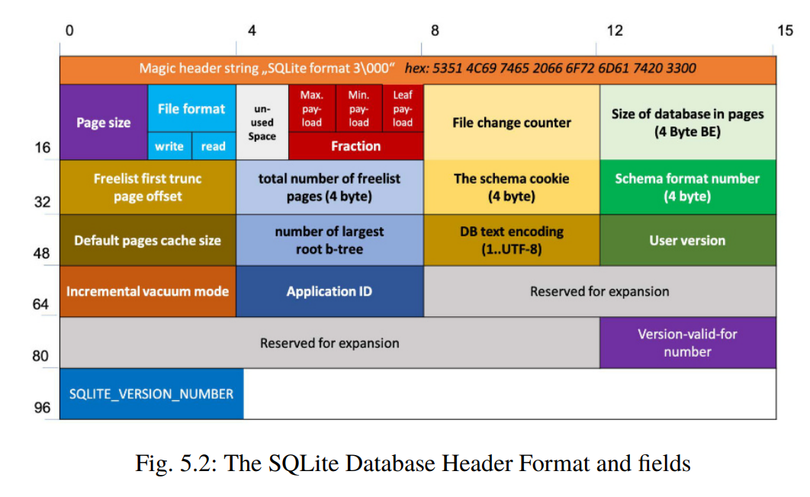

> Simplicity leads to reliability and I don’t know of a more reliable database than SQLite.

`Much of the info is taken from https://fly.io/blog/sqlite-internals-btree/`

### Note on Varints

This encoding is used so that we don’t use a huge 8-byte field for every integer.

The high bit is used as a flag to indicate if there are more bytes to be read and the other 7 bits are our actual data.

To represent 1,000, we start with its binary representation split into 7 bit chunks:

> 0000111 1101000

We add a 1 to signify mnore chunks to come and 0 for the final

> 10000111 01101000

### Integer packing

Integers that can fit in an 8-bit integer are represented with a type value of 0x01. 16-bit integers are 0x02, 24-bit integers are 0x03 and so on.

### SQLite row representation

SQLite stores information in a B-Tree format

B-Trees contian an arbitrary N values per node, having up to N + 1 children, where each chil represents a node whose values are between the i_th and i+1_th value

One row of data exists as an array of bytes inside SQLite that’s encoded using

For a table of definition

```
CREATE TABLE sandwiches (
    id INTEGER PRIMARY KEY,
    name TEXT,
    length REAL, # size of sandwich
    count INTEGER # times eaten
)
```

```
INSERT INTO sandwiches (name, length, count) VALUES ('Italian', 7.5, 2)
```

is

`15 01 05 00 1b 07 01 49 74 61 6c 69 61 6e 40 1e 00 00 00 00 00 00 02`

- 0x15 is the size of our row’s payload, in bytes. VARINT
- Next value is the **Primary Key**: id = `0x01`. VARINT
- The next two are ignored for now (page overflow info)

### Type encoding

`1b 07 01`

_name, size, and count_ types are encoded as varints.

Type values that are >= 13 are `TEXT` and follow the formula `(n*2) + 13`.

`BLOB` fields are similar except they’re even numbers calculated as (n\*2) + 12.

- Name = `0x1b`= TEXT. (7\*2) + 13 which is 27, or `0x1b`therefore size is 7.

- Length = floating-point number = type encoded as `0x07`.
- Count = `0x01`= int that can fit in 8-bit integer

## Value encoding

### Name

Name is 7 bytes so we get the section

```
49 74 61 6c 69 61 6e
```

which equals _"Italian"_ in UTF-8

### Length

IEEE-754-2008 encoding or pure integer if not decimal. But since we inserted 7.5 into the row, it is floating point:

```
40 1e 00 00 00 00 00 00
```

### Count

We know it's 1 byte: `02`.

# Pages and B-Trees

SQLite groups rows together into 4KB chunks called “pages”. 4KB aligns with what most OS's use for memory paging, thus we can align memory more easily

### Page format


Looking at the page header (non relevant info is masked):

`0d xx xx 00 03 xx xx xx`

- 0x0d, indicates the page type. This page type is a table leaf.
- cell count is `0x0003`. This tells us that 3 records exist in this page.

After the header, we have the *cell pointer index*:

```
0f e9 0f d2 0f bb
```

This is a list of 2-byte values that represent offsets in the page for each record.

The first record exists at offset 4,073 (0x0fe9), the second record exists at offset 4,050 (0x0fd2).
After the index, we have a bunch of zeros until we reach the content area of the page which holds our row data in record format.


### Searching
You can easily search by primary key using binary search

SQLite is structured as a **b-tree**, which is a data structure where each node can point to two or more child nodes and the values in these child nodes are all sorted. 

SQLite actually uses a variante **B+Tree**. B+Trees store all the data in leaf nodes and keys in the tree nodes. The leaf nodes actually point to eachother in sequence to provide ordered traversal-

Let's say we have 101 rows at each 40Bytes. Since a page is 4KB, it only fits, at most 100 rows.

So SQLite will split them over two leaf nodes and keep an interior node that points to them.

Interior pages are also 4kb. Store pairs of child primary keys and their page numbers = **8 bytes** = 500 entries per interior page.
For a 2MB database, of 40 byte rows, all the rows paris would fit in a  single interior page, meaning search will take at most 2 pages!

If we go over 500 references, we can have 500 references to integer pages, meaning **500*500=250000** pages, or 1GB of data.


# Format diagram

Check https://saveriomiroddi.github.io/SQLIte-database-file-format-diagrams/

Each interior b-tree page has cells. Each cell contains a key and a pointer

# More SQLite info

Paper: https://link.springer.com/content/pdf/10.1007/978-3-030-98467-0_5.pdf

The database file starts with a header part of exactly 100 bytes.

After this, pages of default size 4096 bytes

### Page type

+age type to first byte:
- table b-tree interior page **0x05**
- table b-tree leaf page **0x0d**
- index b-tree interior page **0x02**
- index b-tree leaf page **0x0a**

interior page: page with links to other pages

**Indexes** are stored in separate B+Trees

The first 16 bytes are just the sqlite version "Sqlite format 3\000"




**A b-tree page is divided into regions in the following order:**

The 100-byte database file header (found on page 1 only)
The 8 or 12 byte b-tree page header
The cell pointer array
Unallocated space
The cell content area
The reserved region


**B-tree Page Header Format**:
- First byte is page type
- 2 bytes starting at offset 3 give the number of cells in the page
- offset 5	size 2: start of cell area in page
